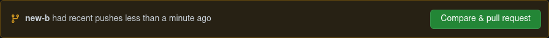

## ASR Web Portal (Frontend)

### Want to run locally and Contribute.

<!-- 1. Fork the repo.

<p align="center">


</p> -->

1. Clone the repo.

   ```
   git clone https://github.com/allenkiakshay/asr-web-portal-frontend.git
   ```

2. Install Dependencies.

   ```
   npm install
   ```

3. add `.env` file and environment variables.

4. Run on localhost.

   ```
   npm run dev
   ```

<!-- 6. Create a new Branch.

   ```
   git checkout -b <new-branch>
   ```

7. Make Changes.

   ```
   Make Changes...
   ```

8. Stage and Commit your code.

   ```
   git add .
   git commit -m "<Some Message to understand what you have done.>"
   ```

9. Push your code.

   ```
   git push --set-upstream origin <new-branch>
   ```

10. Compare and raise pull request.
  <p align="center">


</p>

11. Thats It, thanks for contributing ❤️ -->
